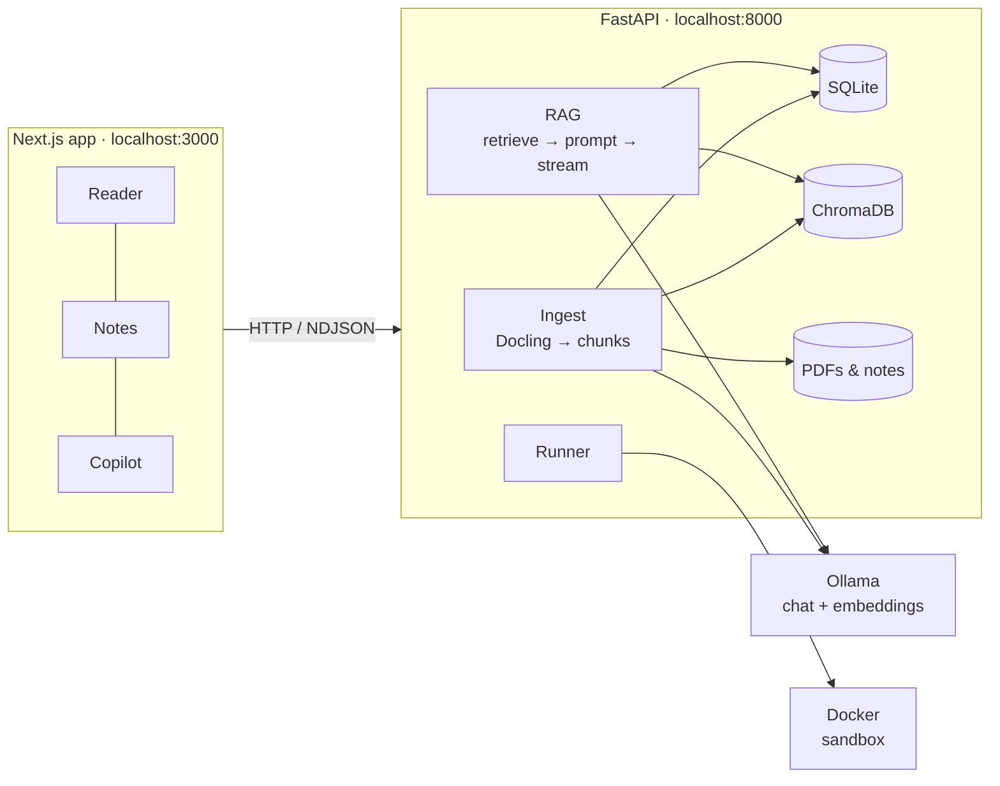

<div align="center">

# 📘 DevBook AI

**A local-first study workspace for programming books.**
Read the PDF, take notes, ask a book-grounded mentor and run the code, all on one screen and all on your machine.

[](LICENSE)


</div>

---

## Why DevBook AI?

Learning from a technical book usually means juggling a PDF viewer, a notes app, an editor and a chatbot, and that chatbot answers from its training data rather than from *your* book.

DevBook AI brings these into one tri-pane workspace:

| 📖 Reader | 📝 Notes | 🤖 Copilot |
|---|---|---|
| Read the PDF, highlight any passage or code listing | Collect quotes with page references; run code blocks inline | Ask questions answered **only from the book**, with **clickable page citations** |

- **🔒 Private by design.** Books, notes, embeddings and the model all stay on your machine. No accounts, no API keys, no telemetry.
- **💸 Zero running cost.** Inference runs locally through [Ollama](https://ollama.com).
- **🎯 Grounded answers.** Every answer cites pages. If the book doesn't cover something, the copilot says so instead of guessing.
- **🧪 Run what you read.** Execute Python and JavaScript snippets in an isolated Docker sandbox and see the output right under the code.

## Features

### MVP (in progress)
- [ ] PDF upload with structure-aware parsing: headings, page numbers and code blocks are preserved
- [ ] Local vector index (ChromaDB + `nomic-embed-text`)
- [ ] Streaming, book-grounded chat with a mentor persona
- [ ] Clickable `[p. 42]` citations that jump the reader to the source
- [ ] Highlight → **Explain via AI** / **Send to Notes**
- [ ] Per-book Markdown notes, auto-saved as plain `.md` files
- [ ] Sandboxed code runner for Python & JavaScript (no network, resource-limited)
- [ ] Health panel for Ollama, models and Docker, with one-line fixes

### Roadmap
- Full Markdown Studio (CodeMirror editor, multiple notes per book)
- **Practice Bug** generator: get a subtly broken version of a snippet to debug
- Active-recall quizzes per chapter, and note review against the book
- EPUB support, library-wide questions, model picker
- One-click desktop app (Tauri), spaced repetition, more runner languages

## Architecture



1. **Ingest:** [Docling](https://github.com/docling-project/docling) turns the PDF into a structured document. Its hybrid chunker splits it along headings without breaking code listings. Each chunk carries its page range and heading path.
2. **Index:** chunks are embedded locally with `nomic-embed-text` and stored in ChromaDB.
3. **Ask:** your question retrieves the most relevant passages from the open book, and a local model (default `qwen2.5-coder:7b`) answers from those passages only. Citations come from retrieval metadata, so page numbers are never invented.
4. **Run:** code blocks execute in throwaway Docker containers with no network access, no host mounts and strict CPU/memory/time limits.

## Tech stack

| Layer | Technology |
|---|---|
| Frontend | Next.js (App Router), TypeScript, Tailwind CSS, shadcn/ui, react-resizable-panels, react-pdf |
| Backend | FastAPI, Python 3.12 |
| Parsing | Docling + HybridChunker |
| Storage | ChromaDB (vectors), SQLite (library & chat history), plain files (PDFs & notes) |
| Models | Ollama: `qwen2.5-coder:7b` (chat), `nomic-embed-text` (embeddings) |
| Sandbox | Docker (`python:3.12-alpine`, `node:22-alpine`) |

## Hardware requirements

Everything runs locally, so your hardware decides which model you can use and how fast it answers.

| Tier | Hardware | Suggested model | Experience |
|---|---|---|---|
| Minimum | CPU only, 16 GB RAM | `qwen2.5-coder:3b` | Works, ~5–10 tokens/s |
| **Recommended** | NVIDIA GPU with 8 GB VRAM, or Apple Silicon with 16 GB | `qwen2.5-coder:7b` | Smooth, ~40–60 tokens/s |
| High | 12–16 GB+ VRAM | `qwen2.5-coder:14b` | Stronger reasoning |

Plan for about **10 GB of free disk** for models and images. On 16 GB machines, consider capping Docker Desktop's WSL2 memory (`.wslconfig`) to keep things responsive.

## Getting started

> ⚠️ **DevBook AI is under active development.** The steps below describe the intended setup; the application code is landing incrementally.

### Prerequisites
- [Ollama](https://ollama.com/download)
- [Docker Desktop](https://www.docker.com/products/docker-desktop/) (only needed for the code runner)
- Python 3.12+
- Node.js 22+

### 1. Pull the models and sandbox images
```bash
ollama pull qwen2.5-coder:7b
ollama pull nomic-embed-text
docker pull python:3.12-alpine
docker pull node:22-alpine
```

### 2. Start the backend
```bash
cd backend
python -m venv .venv
# Windows: .venv\Scripts\activate   |   macOS/Linux: source .venv/bin/activate
pip install -e .
uvicorn app.main:app --host 127.0.0.1 --port 8000
```
> **NVIDIA on Windows:** install the CUDA build of PyTorch first for faster parsing:
> `pip install torch torchvision --index-url https://download.pytorch.org/whl/cu128`

### 3. Start the frontend
```bash
cd frontend
npm install
npm run dev
```

Open **http://localhost:3000**, drop in a PDF, and start studying.

### Configuration
The backend reads optional environment variables:

| Variable | Default | Description |
|---|---|---|
| `DEVBOOK_CHAT_MODEL` | `qwen2.5-coder:7b` | Ollama chat model |
| `DEVBOOK_EMBED_MODEL` | `nomic-embed-text` | Ollama embedding model |
| `DEVBOOK_OLLAMA_URL` | `http://127.0.0.1:11434` | Ollama endpoint |
| `DEVBOOK_DATA_DIR` | `./data` | Where the library, index and notes live |
| `DEVBOOK_TOP_K` | `6` | Passages retrieved per question |
| `DEVBOOK_RUN_TIMEOUT` | `10` | Sandbox time limit (seconds) |

## Project structure

```
DevBook-AI/
├─ backend/     # FastAPI: ingestion, retrieval, chat streaming, notes, code runner
├─ frontend/    # Next.js: reader, notes, copilot
└─ data/        # created at runtime (gitignored): SQLite, ChromaDB, PDFs, notes
```

## Privacy

DevBook AI makes **no outbound network requests** during normal use. The only downloads are ones you start yourself: model pulls through Ollama and Docker image pulls. Your books and notes are regular files in `data/` that you can back up, move or delete at any time.

## Contributing

Contributions are welcome once the MVP lands. Until then, feel free to open an issue with ideas, bugs or book-parsing edge cases (tricky PDFs are especially useful).

1. Fork the repo and create a branch: `git checkout -b feat/your-idea`
2. Use [Conventional Commits](https://www.conventionalcommits.org/) (`feat:`, `fix:`, `docs:` …)
3. Open a pull request describing the change and how you tested it

## License

[MIT](LICENSE) © 2026 ZeroElemental

The models you run are covered by their own licenses (for example, Qwen2.5-Coder and nomic-embed-text are Apache-2.0). You're responsible for having the right to use the books you import.
